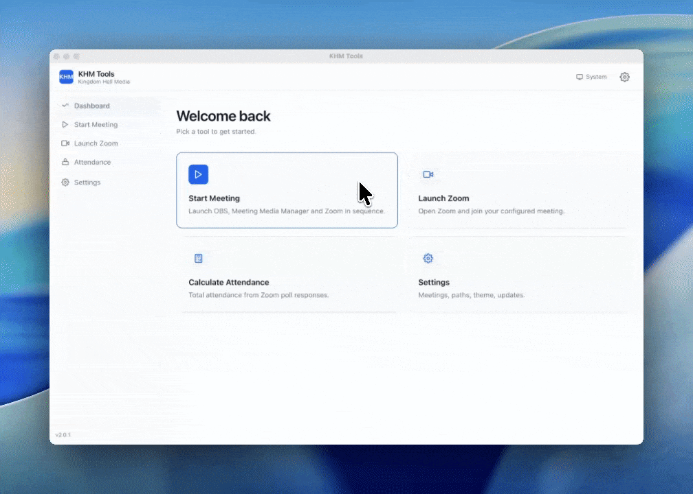

# KHM Tools

A free desktop tool for Kingdom Hall AV operators and Zoom attendants. One click to launch your programs, a clean attendance calculator, and a guided setup — so you can focus on the meeting, not the tech.

---

## What it does

### Start a Meeting
Launches [OBS Studio](https://obsproject.com), [Meeting Media Manager (M³)](#works-alongside), and [Zoom](https://zoom.us) in the correct sequence with a single click — no more scrambling at program time.

### Zoom Launcher
Opens Zoom and joins your configured meeting directly. Handy for Zoom attendant computers that only need that one step.

### Attendance Calculator
Paste your Zoom poll responses and get a clean combined count in seconds — no spreadsheet needed.

### Guided Setup (Onboarding)
A 7-step wizard walks first-time users through connecting their meeting schedule, Zoom meeting ID, and application paths. Anyone on the AV desk can complete it.

### Auto-Update
The app keeps itself current. Pick between stable and beta update channels in Settings — updates install in the background.

---

## Download

Go to the **[Releases page](https://github.com/advenimus/khmtools/releases/latest)** to download the latest version for macOS, Windows, or Linux.

> **macOS note:** If macOS blocks the app on first launch, right-click → Open. The app is signed and notarized with Apple.

---

## Works alongside

KHM Tools is designed to complement:

| Tool | Purpose |
|------|---------|
| [Meeting Media Manager (M³)](https://github.com/sircharlo/meeting-media-manager) | Download and display congregation meeting media |
| [OBS Studio](https://obsproject.com) | Scene switching and in-hall display |
| [Zoom](https://zoom.us) | Video conferencing for remote attendees |

---

## Contributing

Want to build from source, run tests, or submit a fix? See [CONTRIBUTING.md](CONTRIBUTING.md).
